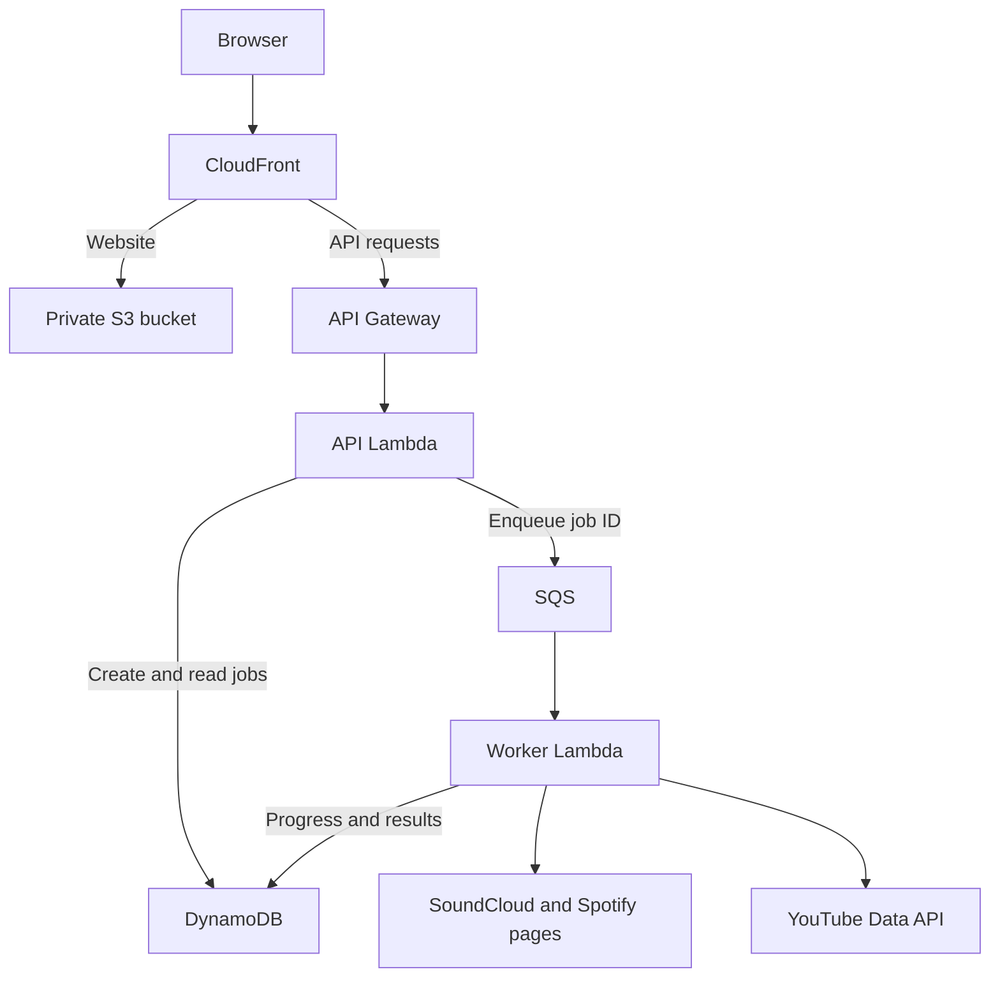

# KaraokeKonverter

[](https://github.com/Chris-57/karaokekonverter/actions/workflows/ci.yml)

I designed KaraokeKonverter to turn a public **SoundCloud or Spotify playlist** into an ordered set of YouTube karaoke matches. I am [Christopher Meumann](https://github.com/Chris-57), and I rebuilt an earlier school project into this AWS application to demonstrate application design, cloud deployment and operations.

**[Open the AWS demo](https://d2j5ofy3dzbrbx.cloudfront.net) · [Try the demo](docs/demo.md) · [Architecture](docs/architecture.md) · [Test evidence](docs/validation.md) · [Operations](docs/monitoring.md) · [Deployment](docs/deployment-automation.md)**

The hosted demo requires an application access code that I share privately. Visitors do not supply a YouTube key or sign into a music service. Public playlists are limited to **20 tracks**. The backend uses YouTube Data API v3 for search; the deployed SoundCloud and Spotify readers extract public-page metadata with Chromium. Spotify Web API/OAuth integration is not implemented.

Example playlists to paste into the demo:

- **SoundCloud:** [KaraokeTesterSoundcloud](https://soundcloud.com/chris-meumann/sets/karaoketestersoundcloud)
- **Spotify:** [KaraoketesterSpotify](https://open.spotify.com/playlist/33DGn1H9Itci505ypgJ3Mw)

Use the playlist URL in the application's input field. Each playlist must be public and contain no more than 20 tracks.

## What it does

- Select SoundCloud or Spotify, paste a playlist URL and optionally name the set.
- Read the complete supported playlist, preserving source order and duplicate entries.
- Search for karaoke candidates using normalized titles and artist information.
- Follow job progress, review each match and keep successful matches when another song cannot be matched.
- Open or copy a temporary YouTube playback link without depending on an external playlist-generator website.

The name applies inside this app. YouTube may display **Untitled List** because this output is not a saved playlist in a YouTube account.

## AWS request flow



Secrets Manager supplies server configuration. Structured logs, CloudWatch metrics and alarms, SNS email notifications, and an EventBridge-scheduled availability Lambda support operation of the application. Infrastructure is defined in [AWS SAM](infra/template.yaml).

| Engineering decision | Purpose |
| --- | --- |
| API and queued worker | Return a job ID promptly while browser extraction and searches run asynchronously |
| Shared provider interface | Reuse matching, progress and output logic across SoundCloud and Spotify |
| Conditional job claim | Avoid reprocessing terminal jobs after duplicate queue delivery |
| Bounded extraction and explicit partial results | Surface incomplete reads and missing matches without silently truncating a playlist |
| Structured, filtered logs | Correlate requests and jobs while excluding keys and raw provider responses |
| Infrastructure as code and CI | Review resource changes and check repeatable builds before deployment |

## Current evidence

Application version **0.3.0** is deployed in AWS Ohio. I tested live conversions for both sources and received the controlled **ALARM and OK** emails. Dashboard screenshots show application metrics, 14 source tracks / 13 matches in the displayed sample, and all ten alarms in OK. These observations are sample acceptance evidence, not an availability or accuracy guarantee.

The source contains **80 JavaScript tests** and Python tests for monitoring, deployment permissions and release recovery. My GitHub CI runs passed, and the delivery bootstrap, temporary OIDC credentials and baseline snapshot checks have worked in AWS. The latest release stopped at the IAM guard before updating the app. Routine releases now preserve the deployed infrastructure while updating the three Lambda code packages and website files. This correction passed 52 local Python tests and full-template validation; a verified live automated release and restore remain outstanding. See [the correction](docs/apply-deployment-fix.md), [validation](docs/validation.md) and [deployment acceptance](docs/evidence/deployment-acceptance.md).

## Run locally

Install **Node.js 24**, Chrome or Edge, and use a YouTube Data API v3 key for your own local instance. From the folder containing `package.json`, run in Windows PowerShell:

```powershell
npm.cmd ci
npm.cmd start
```

Open **http://localhost:3000**, paste your key into **YouTube connection → Test and save**, then submit a playlist. Local settings are saved outside this repository. No `.env` file is required. On macOS/Linux, use `npm` in place of `npm.cmd`.

[Detailed setup](docs/local-setup.md) covers key storage, subsequent starts and browser behavior. [Local troubleshooting](docs/local-runbook.md) covers provider/setup errors.

## Checks

```powershell
npm.cmd run check:public
npm.cmd ci
npm.cmd test
npm.cmd run check
```

The public-repository check needs Node only; it also inspects the Git index when Git is available. Python 3.12 runs the monitoring and delivery tests with `python -m unittest discover -s tests -p 'test_*.py'`. GitHub CI performs these checks plus application/bootstrap template validation, a clean Lambda build and packaged-handler imports. Tests use fixtures and do not spend YouTube quota.

## Documentation

| Document | What to look for |
| --- | --- |
| [Demo guide](docs/demo.md) | Hosted demo steps and reviewer access |
| [My design decisions](docs/design-decisions.md) | Why I chose this architecture and what I learned |
| [Architecture](docs/architecture.md) | API contract, data flow, job handling and service boundaries |
| [Monitoring runbook](docs/monitoring.md) | Dashboard, alarm thresholds, notification test and incident response |
| [Validation record](docs/validation.md) | Automated checks, my live observations and remaining checks |
| [CI workflow](docs/ci.md) | Triggers, permissions, pinned tools and build verification |
| [Deployment automation](docs/deployment-automation.md) | GitHub OIDC, application-only releases and separate infrastructure updates |
| [Deployment recovery](docs/deployment-recovery.md) | Restore verified code/assets and handle interrupted deployments |
| [AWS deployment](docs/aws-deployment.md) | Existing-stack updates, first installs and website publishing |
| [Operations runbook](docs/runbook.md) | Troubleshooting, recovery and resource retirement |
| [Security and credentials](SECURITY.md) | Configuration boundaries and safe issue reporting |
| [Roadmap](docs/roadmap.md) | OIDC deployment automation and future work |
| [Publishing guide](docs/github-publishing.md) | First publication under Chris-57 |
| [Changelog](CHANGELOG.md) | Release history and fixes |

## Limits and provider access

Public-page readers depend on the metadata a provider exposes. Login requirements, verification, localization or DOM changes can stop extraction. The app stops on those conditions. Matching is based on metadata; users should review the returned videos.

Spotify's [User Guidelines](https://www.spotify.com/us/legal/user-guidelines/) restrict scraping. This browser adapter is a controlled portfolio demonstration, not an approved Spotify integration; a supported access approach is required before broad public-service use. An optional official SoundCloud API adapter is included for operators with SoundCloud app credentials. [Architecture decisions](docs/architecture.md) explain these boundaries.

The hosted demo uses my AWS resources and YouTube quota. The 20-track limit, access code, throttling and queue controls bound parts of that usage; budget emails are notifications, not a spending cap. [Monitoring costs](docs/monitoring.md#costs-and-retention) document the current footprint.

Source is published for portfolio review. No additional open-source license has been selected. Third-party dependencies retain their respective licenses.
