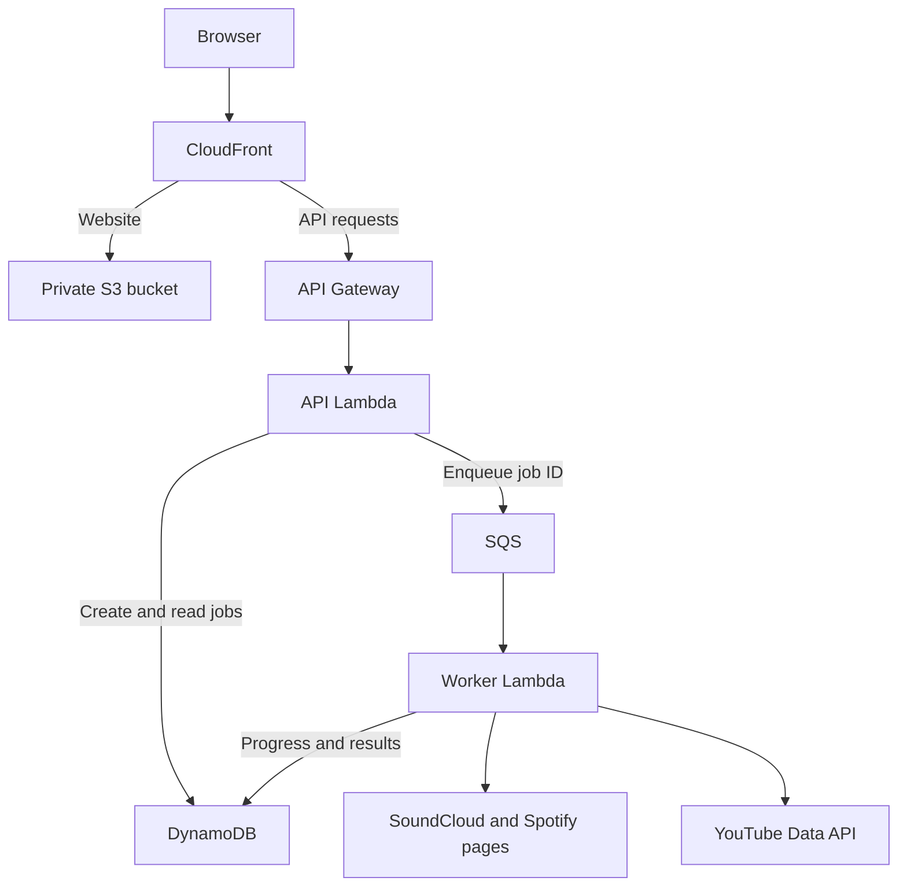

# KaraokeKonverter

[](https://github.com/Chris-57/karaokekonverter/actions/workflows/ci.yml)

Turn a public **SoundCloud or Spotify playlist** into an ordered set of YouTube karaoke matches. Built by [Christopher Meumann](https://github.com/Chris-57) as an AWS application and infrastructure-operations portfolio project, rebuilding an earlier school project.

**[Open the AWS demo](https://d2j5ofy3dzbrbx.cloudfront.net) · [Try the demo](docs/demo.md) · [Architecture](docs/architecture.md) · [Test evidence](docs/validation.md) · [Operations](docs/monitoring.md)**

The hosted demo requires an application access code supplied privately by the owner. Visitors do not supply a YouTube key or sign into a music service. Public playlists are limited to **20 tracks**. The owner's backend uses YouTube Data API v3 for search; the deployed SoundCloud and Spotify readers extract public-page metadata with Chromium. Spotify Web API/OAuth integration is not implemented.

## What it does

- Select SoundCloud or Spotify, paste a playlist URL and optionally name the set.
- Read the complete supported playlist, preserving source order and duplicate entries.
- Search for karaoke candidates using normalized titles and artist information.
- Follow job progress, review each match and keep successful matches when another song cannot be matched.
- Open or copy a temporary YouTube playback link without depending on an external playlist-generator website.

The name applies inside this app. YouTube may display **Untitled List** because this output is not a saved playlist in a YouTube account.

## AWS request flow



Secrets Manager supplies server configuration. Structured logs, CloudWatch metrics and alarms, SNS email notifications, and an EventBridge-scheduled availability Lambda support operation of the application. Infrastructure is defined in [AWS SAM](infra/template.yaml).

| Engineering decision | Purpose |
| --- | --- |
| API and queued worker | Return a job ID promptly while browser extraction and searches run asynchronously |
| Shared provider interface | Reuse matching, progress and output logic across SoundCloud and Spotify |
| Conditional job claim | Avoid reprocessing terminal jobs after duplicate queue delivery |
| Bounded extraction and explicit partial results | Surface incomplete reads and missing matches without silently truncating a playlist |
| Structured, filtered logs | Correlate requests and jobs while excluding keys and raw provider responses |
| Infrastructure as code and CI | Review resource changes and check repeatable builds before deployment |

## Current evidence

Application version **0.3.0** is deployed in AWS Ohio. The owner has verified live conversions for both sources and received the controlled **ALARM and OK** emails. Dashboard screenshots show application metrics, 14 source tracks / 13 matches in the displayed sample, and all ten alarms in OK. These observations are sample acceptance evidence, not an availability or accuracy guarantee.

The source contains **76 application/monitoring JavaScript tests plus four repository-check tests**, and **five Python monitoring-CLI tests**. CI is included in this repository; its first GitHub-hosted run must succeed after publication. Automated AWS deployment is the next stage and is not enabled by this initial workflow. See [validation](docs/validation.md) and [CI](docs/ci.md) for the precise scope.

## Run locally

Install **Node.js 24**, Chrome or Edge, and use a YouTube Data API v3 key for your own local instance. From the folder containing `package.json`, run in Windows PowerShell:

```powershell
npm.cmd ci
npm.cmd start
```

Open **http://localhost:3000**, paste your key into **YouTube connection → Test and save**, then submit a playlist. Local settings are saved outside this repository. No `.env` file is required. On macOS/Linux, use `npm` in place of `npm.cmd`.

[Detailed setup](docs/local-setup.md) covers key storage, subsequent starts and browser behavior. [Local troubleshooting](docs/local-runbook.md) covers provider/setup errors.

## Checks

```powershell
npm.cmd run check:public
npm.cmd ci
npm.cmd test
npm.cmd run check
```

The public-repository check needs Node only; it also inspects the Git index when Git is available. Python 3.12 runs the monitoring-CLI tests with `python -m unittest discover -s tests -p 'test_*.py'`. GitHub CI performs these checks plus SAM validation, a clean Lambda build and packaged-handler imports. Tests use fixtures and do not spend YouTube quota.

## Documentation

| Document | What to look for |
| --- | --- |
| [Demo guide](docs/demo.md) | Hosted demo steps and reviewer access |
| [Architecture](docs/architecture.md) | API contract, data flow, job handling and service boundaries |
| [Monitoring runbook](docs/monitoring.md) | Dashboard, alarm thresholds, notification test and incident response |
| [Validation record](docs/validation.md) | Automated checks, owner-provided live evidence and remaining checks |
| [CI workflow](docs/ci.md) | Triggers, permissions, pinned tools and build verification |
| [AWS deployment](docs/aws-deployment.md) | Existing-stack updates, first installs and website publishing |
| [Operations runbook](docs/runbook.md) | Troubleshooting, recovery and resource retirement |
| [Security and credentials](SECURITY.md) | Configuration boundaries and safe issue reporting |
| [Roadmap](docs/roadmap.md) | OIDC deployment automation and future work |
| [Publishing guide](docs/github-publishing.md) | First publication under Chris-57 |
| [Changelog](CHANGELOG.md) | Reconstructed release history |

## Limits and provider access

Public-page readers depend on the metadata a provider exposes. Login requirements, verification, localization or DOM changes can stop extraction. The app stops on those conditions. Matching is based on metadata; users should review the returned videos.

Spotify's [User Guidelines](https://www.spotify.com/us/legal/user-guidelines/) restrict scraping. This browser adapter is a controlled portfolio demonstration, not an approved Spotify integration; a supported access approach is required before broad public-service use. An optional official SoundCloud API adapter is included for operators with SoundCloud app credentials. [Architecture decisions](docs/architecture.md) explain these boundaries.

The hosted demo uses the owner's AWS resources and YouTube quota. The 20-track limit, access code, throttling and queue controls bound parts of that usage; budget emails are notifications, not a spending cap. [Monitoring costs](docs/monitoring.md#costs-and-retention) document the current footprint.

Source is published for portfolio review. No additional open-source license has been selected. Third-party dependencies retain their respective licenses.
