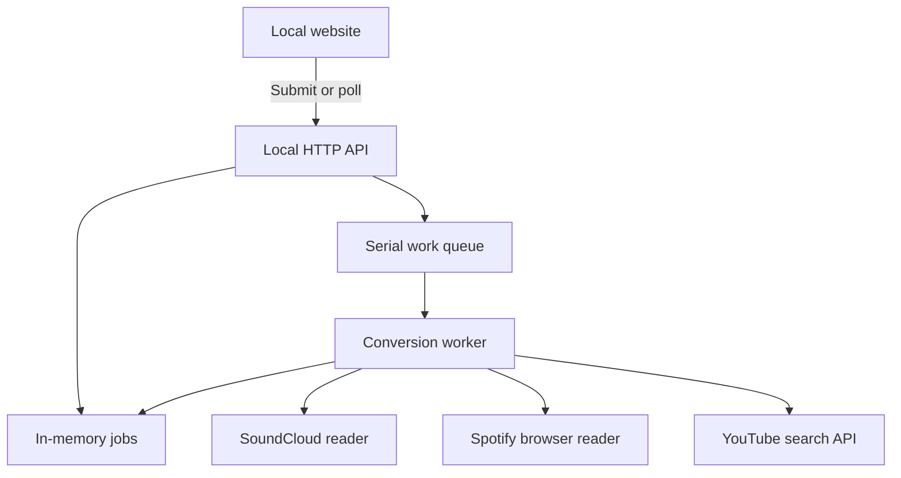

# Architecture: local and AWS application

I designed the application around a shared conversion workflow, with separate source adapters and an asynchronous AWS worker. [My design decisions](design-decisions.md) explain the rationale and tradeoffs; this document describes the implemented interfaces and resource boundaries.

Application version 0.3.0; documentation refreshed for public repository preparation on September 8, 2026. This documents a new implementation reconstructed from a personal school project. It does not claim the original assignment used every component in this rebuild.

## Implemented request flow

The local website offers SoundCloud and Spotify source selection. It submits the source, canonical public URL and optional set name to the HTTP API. Both sources return the same ordered track metadata and use one conversion worker and YouTube matcher.



Browser code accesses job records through the API. The SoundCloud reader can use the existing browser mode or an operator-configured official API adapter. Spotify uses the DOM extraction and collection logic validated in the separate local probe. There is no Spotify API key or user OAuth flow in this local implementation.

1. The website reads `/api/health` and obtains a local session token from `/api/session`.
2. Local setup uses `POST /api/local/youtube` with a visible pasted key (or an empty body to test the current key). One real search must succeed before the key is saved. The active runtime is refreshed after saving. A server restart requires another explicit test, but page reloads do not. `POST /api/conversions` checks that session and the current verified state, validates the explicitly selected provider and URL, creates a job, and queues its ID. A mismatched provider/URL fails before creating a job.
3. The local queue processes one job at a time. The store's claim operation prevents a duplicate delivery from processing a terminal or currently claimed job again.
4. The worker dispatches to the reader selected by the persisted job's `source`. It never guesses the provider from the currently selected UI tab.
5. Source extraction completes before YouTube calls start. Spotify requires a displayed count, contiguous positions, titles and artists. Recommendations are excluded; virtualized rows are merged by position, preserving deliberate duplicates. Count/position conflicts, verification, missing metadata and oversized playlists fail explicitly.
6. Normalization retains display titles and artist credits. Search removes known edition metadata and featured-artist labels; a Spotify `(with Artist)` credit is removed only when that artist appears in the track's credits. Search uses the primary Spotify artist, while matching accepts a credited artist in a candidate title. SoundCloud uploader hints retain their softer ranking behavior.
7. YouTube search considers up to five candidates per query and one fallback query. It requires title coverage and karaoke/instrumental indicators. Candidate metadata is not proof of vocal-free audio or correct lyrics.
8. Results are saved after each track. The final status is COMPLETE, PARTIAL or FAILED. Provider-wide search errors stop further calls and preserve earlier handled successes.
9. The website displays source metadata, review links and a directly constructed temporary playback URL. The same URL appears in a read-only field with copying and a manual fallback.

## Local access and configuration

The startup entrypoint binds to `127.0.0.1`, detects Chrome/Edge, loads local configuration and generates a new session token. The website obtains that token automatically; visitors to this local page do not type an access code. The server verifies its Host and Origin, rejects cross-site API requests and sends no permissive CORS headers. The session stays in browser memory and is never a provider credential.

The local operator enters the YouTube key visibly in the local setup form; the server sends it to Google in an API-key header. Conversion and setup status responses never return the saved key. Setup saves it in the user's application-configuration directory, outside the project. The saved YouTube key takes precedence over environment and `.env` values so a tested replacement survives an old shell setting. Other settings retain their existing environment-first precedence. The local settings file is plaintext configuration, not a remote secret vault. Neither it nor credentials belong in the release archive or source control.

The session and key-setup endpoints are local-only. Setup is serialized and cannot change credentials during an active job. Failed verification or disk writes leave the prior saved key untouched. Conversion readiness is revoked after a later YouTube error, while existing job results remain readable. The AWS API handler has no `/api/session` implementation and retains its configured access-code requirement. A public service will need deliberate usage controls and an authentication/access design; forwarding the local server through a tunnel is not that design.

## HTTP contract

| Route | Access | Result |
| --- | --- | --- |
| `GET /api/health` | Local Host/Origin boundary; no session required | Configuration booleans, per-source readiness, version, track limit, authentication mode and output mode |
| `GET /api/session` | Local Host/Origin boundary | Local session token; no provider keys |
| `GET /api/local/youtube` | Bearer session and local Host/Origin boundary | Key-present and verification status; never the key |
| `POST /api/local/youtube` | Same local authorization; application/json | Test exactly one search, save on success and refresh runtime; preserves prior key on failure |
| `POST /api/conversions` | Bearer session locally; configured access code in the AWS baseline | HTTP 202 with job ID and status URL |
| `GET /api/conversions/{id}` | Same authorization | One job's progress/results, or 404 for missing/expired jobs |

Request example:

```json
{
  "source": "spotify",
  "url": "https://open.spotify.com/playlist/30NcvL51dhP4HKscAuzKY7",
  "playlistName": "Friday karaoke"
}
```

Omitting `source` preserves the older SoundCloud API contract. Source names are restricted to the enabled providers. The shared source configuration enables SoundCloud and Spotify in both AWS handlers. Health exposes these names so the existing frontend enables the source controls. Readiness means required configuration is present, not that a live provider request has passed.

## Data and failure handling

Jobs contain UUID, source, source URL, optional app playlist name, source title, status/stage, processed/total counts, ordered results, timestamps and a 24-hour expiration time. An internal claim lease is omitted from public responses. The local store is in memory, so restarts remove local jobs.

Each normalized track contains position, original title and an artist display string. Spotify tracks also retain their `artists` array and a reliable-credit marker for matching. Source positions preserve order; a repeated source song at a second position is a second item.

A final result can contain MATCHED, UNMATCHED, ERROR and SKIPPED tracks. Failures from known adapters use bounded, sanitized messages. YouTube responses are mapped from known Google ErrorInfo/legacy reasons to local codes for invalid keys, disabled APIs, restrictions, quota, denial and availability. Raw Google error messages, project numbers and request URLs are not returned. All YouTube service failures stop further song searches; an API rejection is never relabeled NO_MATCHES. Logs contain job ID, source, status, counts and timings, without API keys or source titles.

## AWS deployment

The retained SAM template defines CloudFront, a private S3 website bucket, API Gateway, an API Lambda, SQS, a worker Lambda, DynamoDB, Secrets Manager, IAM permissions, CloudWatch logs/alarms, an SNS topic and a dead-letter queue. I tested both sources successfully in the deployed AWS application. I also deployed the 0.3.0 monitoring update, received the controlled ALARM/OK emails and observed populated dashboard metrics. [The evidence record](evidence/monitoring-acceptance.md) distinguishes these observations from unperformed load/fault tests.

The cloud queue/store replace the local serial queue and memory store while preserving the job contract. The account reports ten total concurrent Lambda executions. The template therefore leaves reserved concurrency unset and limits the SQS event-source mapping to two simultaneous workers. This is a queue-level limit, with no reserved capacity; other functions can still exhaust the shared account pool. Runtime dependencies are pinned. The API and worker share the same source configuration and 20-track cap. Browser readers use headless Chromium in Lambda; Spotify does not need a desktop executable path, signed-in browser profile or developer key. See `aws-update-v0.3.0.md`, `aws-acceptance.md` and `runbook.md`.

Spotify allows up to 100 collection rounds within a 75-second collection budget after navigation, with waits capped at 750 ms between rounds. Navigation and browser protocol calls have their own timeouts. Reaching the scroll boundary alone does not terminate an incomplete read. A complete count/order result must stabilize across repeated snapshots. The browser is closed in `finally` on success and failure. Logs distinguish startup, preparation, navigation and extraction errors and include counts without raw page content.

## Decisions and limits

| Decision | Purpose | Limit or tradeoff |
| --- | --- | --- |
| One source interface and one worker | Reuse matching, progress and output logic | Each provider still needs its own validation and access decisions |
| Twenty-track conversion limit | Bound one job's provider work | The 50-song extraction test cannot be submitted directly to this converter |
| Complete Spotify metadata before search | Avoid silently converting only the loaded fragment | Unknown/localized counts may reject an otherwise public playlist |
| Visible Spotify browser locally; headless Chromium in AWS | Use the browser runtime available in each environment | Local success does not establish AWS provider reachability |
| Direct temporary YouTube URL | Remove the old external playlist-generator dependency | YouTube controls the Untitled List label and future URL behavior |
| Automatic local session | Remove manual access-code setup | Suitable only for the loopback app with its request-origin checks |
| Spotify public-page adapter in local and AWS code | Demonstrate the requested URL-only conversion path | Spotify's scraping restriction remains unresolved for general public support |

Spotify's [User Guidelines](https://www.spotify.com/us/legal/user-guidelines/) prohibit scraping. A public page returning metadata establishes technical access, not platform approval. This release enables the requested controlled demonstration; a general public release still needs a supported-access decision.

## Monitoring added in 0.3.0

The API and worker emit correlated JSON records and handled operational-failure signals. CloudWatch Logs metric filters publish ten bounded custom series without per-job or per-song dimensions. HTTP API access logs capture requests that may fail before Lambda. A separate dependency-free Lambda, scheduled by EventBridge every five minutes, checks the CloudFront website and public configuration endpoint. Its IAM role only permits writing its own logs. No provider request, secret access or job submission occurs in a scheduled check.

Ten alarms and an 18-widget dashboard combine custom and native service metrics. CloudFront metrics are read in us-east-1; application metrics remain in the deployment region. The existing SNS topic sends failure and recovery notifications. An IAM-only test event exercises a separate metric/alarm and never changes application state. [The monitoring runbook](monitoring.md) describes limitations, recovery and costs.

## AWS service responsibilities

| Service | Responsibility | Important boundary |
| --- | --- | --- |
| CloudFront / private S3 | HTTPS website delivery and API forwarding | OAC keeps the source bucket private; API responses are not cached |
| API Gateway / API Lambda | Validate requests, create/read jobs, enqueue IDs | Shared app code; source/URL validation before work |
| SQS / worker Lambda | Execute browser reading and YouTube matching asynchronously | Batch size one, partial batch failure responses, maximum two concurrent queue workers |
| DynamoDB | Job state, progress, lease and 24-hour TTL | Conditional claims skip terminal/active/expired work; no per-user ownership |
| Secrets Manager / IAM | Server configuration and execution permissions | Credentials do not enter frontend responses |
| CloudWatch Logs / metrics / alarms | Correlated diagnostics and infrastructure/application signals | Four groups retain logs for 14 days; fixed metric series avoid per-job cardinality |
| EventBridge / availability Lambda | Scheduled website and configuration checks | No browser conversion or YouTube quota used by the probe |
| SNS | Failure and recovery email notifications | Confirmed email delivery demonstrated with an isolated test |

The public [README diagram](../README.md#aws-request-flow) shows the AWS request topology. [CI](ci.md) builds these resources' artifacts without deploying them.
