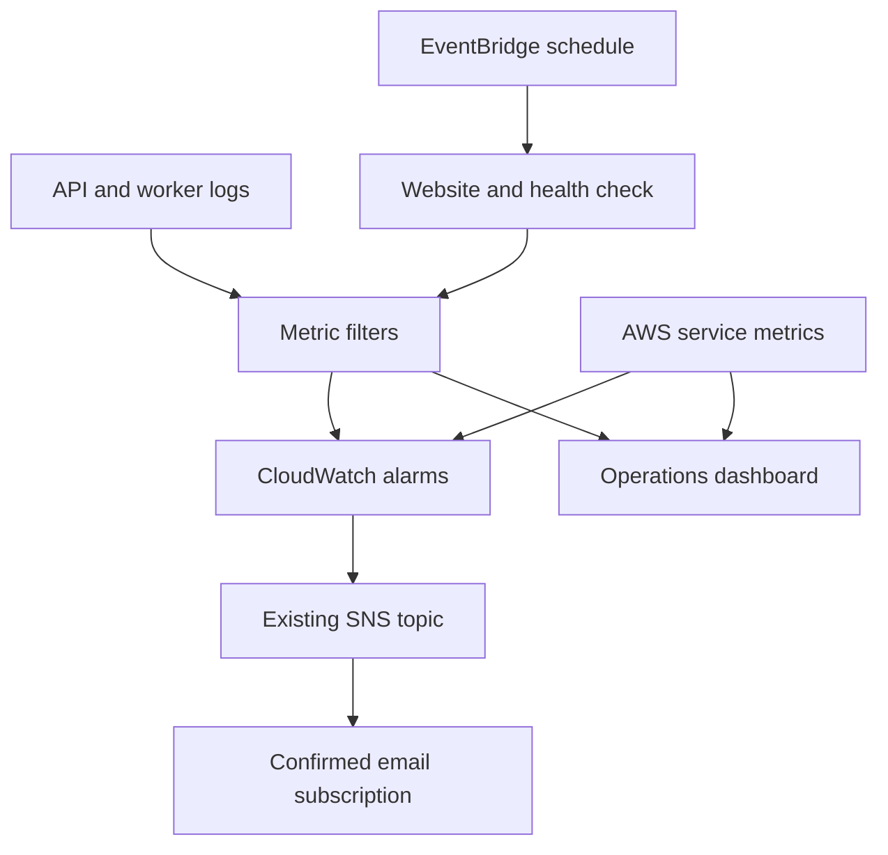

# CloudWatch monitoring and incident response — 0.3.0

The owner reports that both SoundCloud and Spotify work on AWS. The existing SNS email subscription is confirmed. This release adds monitoring to the same stack; cloud deployment and receipt of the test emails remain owner-run acceptance steps.

## Coverage

| Component | What it tells you |
| --- | --- |
| Operations dashboard | Conversion outcomes, matches, processing/waiting time, API traffic/latency, Lambda failures/throttles, queue backlog, database throttles, CloudFront errors, availability and notification failures |
| Structured API/worker logs | Job ID, Lambda request ID, API Gateway request ID, SQS message ID, source, safe error code, counts and elapsed time |
| HTTP API access logs | Requests/errors that may never reach Lambda, correlated by `apiRequestId`; no headers, access code, raw URL, IP address or request body |
| Application metric filters | Handled failures that Lambda's native Errors metric does not capture, including a PARTIAL result caused by YouTube quota exhaustion |
| Scheduled availability Lambda | Every five minutes, fetch the CloudFront HTML and `/api/health`; verify configuration for both sources and the 20-track contract |
| SNS | ALARM and OK notifications to the existing confirmed subscription |
| Isolated test alarm | Test real Lambda log → metric filter → alarm transition → SNS publish; does not modify a conversion or its provider credentials |



The probe has a dedicated role that can write only its own log streams. It does not read Secrets Manager, enqueue jobs, access DynamoDB, launch Chromium or call music providers. Requests have an eight-second deadline, bounded response sizes and no redirect following. The two HTTP requests run concurrently; the Lambda timeout is 25 seconds. EventBridge and asynchronous invocation retries have finite age limits.

This is an availability probe implemented with EventBridge and Lambda, not a CloudWatch Synthetics canary. It verifies HTML delivery and configuration, not JavaScript execution, song extraction, current Google key validity, remaining quota or successful karaoke conversion. A green check is not proof that Spotify or SoundCloud is currently reachable. Use a small live conversion to verify those dependencies.

## Alarms and starting thresholds

These are initial thresholds for a low-volume demonstration, not a measured service-level objective. They can be adjusted in `infra/template.yaml` after observing real traffic. All alarms send ALARM and OK actions to the existing topic.

| Logical resource | Signal and threshold | Missing data |
| --- | --- | --- |
| `OperationalFailuresAlarm` | At least one handled operational failure in a five-minute period | Not breaching |
| `ApiErrorsAlarm` | At least one API Lambda crash/timeout in five minutes | Not breaching |
| `ApiServerErrorsAlarm` | At least one HTTP API 5xx in five minutes | Not breaching |
| `WorkerErrorsAlarm` | At least one worker Lambda crash/timeout in five minutes | Not breaching |
| `LambdaThrottlesAlarm` | At least one throttle across API, worker and probe in five minutes | Not breaching |
| `QueueAgeAlarm` | Oldest visible job at least 600 seconds old in two of three one-minute samples | Not breaching |
| `DeadLetterAlarm` | At least one visible dead-letter message in one minute | Not breaching |
| `DatabaseThrottlesAlarm` | At least one DynamoDB read/write throttle event in five minutes | Not breaching |
| `AvailabilityAlarm` | Failed or missing probe samples in two of three five-minute periods | Breaching |
| `MonitoringTestAlarm` | Isolated test signal at least one in a one-minute period | Not breaching |

CloudWatch evaluation and service metric delivery are asynchronous. A five-minute period is not a promise of an email exactly five minutes after a failure. Missing probe data must be treated as a problem because a stopped schedule or broken probe cannot report its own failure. Expect initial metric warm-up, potentially an availability ALARM, during approximately the first 15 minutes. Initial OK notifications can also occur when new alarms first evaluate. After warm-up, investigate a continuing availability alarm.

One incident can trigger related alarms; for example, a configuration failure can cause both application and API 5xx alarms. Group these by time and request/job identifiers during investigation. Error-count alarms returning OK mean that new errors are no longer observed in their evaluation window; verify provider recovery with a small live job. SNS sends on transitions, not a repeating reminder for every period that an alarm stays ALARM.

## Application outcomes and metric interpretation

`conversion_finished` and `conversion_failed` emit a single terminal record with `outcome: 1` after the terminal DynamoDB update succeeds. Each record has exactly one of `completedJobs`, `partialJobs`, `failedJobs` set to 1. Source, job/request IDs and error codes are log fields, not metric dimensions.

Normal missing karaoke matches, empty/oversized/unavailable playlists, required playlist login and inconsistent metadata are visible in failed/partial counts without paging. Browser startup/timeouts/layout/incomplete-read/verification failures, YouTube quota or key failures, infrastructure retries and unexpected errors set `operationalFailure: 1`. Missing/removed playlist HTTP responses (401/404/410) are content failures; service errors, rate limits and denied browser requests remain operational. Unknown failure codes default to operational. Some provider failures can be specific to one playlist; an alert asks the operator to investigate rather than claiming a global outage.

An API 503 is counted even when the handler returns successfully. An SQS partial batch failure is counted even when the worker invocation has no native Lambda error. Duplicate completed deliveries log `conversion_skipped` and emit no extra terminal outcome. Hard crashes/timeouts that prevent application logging are covered by native Lambda alarms.

The ten custom metric series are:

| Metric | Interpretation |
| --- | --- |
| `CompletedJobs`, `PartialJobs`, `FailedJobs` | Worker terminal outcomes, including expected content failures |
| `OperationalFailures` | API 5xx completions, operational conversion outcomes and infrastructure retry failures |
| `JobDurationMs` | Time from a successful claim/read of the job to a persisted terminal result |
| `QueueWaitMs` | Time from original submission to this successfully claimed delivery; retries include their waiting time |
| `SourceTracks`, `MatchedTracks` | Normalized track count and successful searches observed by terminal processing; extraction failures can contribute zero |
| `AvailabilityFailures` | 0 for a successful website/configuration probe, 1 for a failed check; absent data means no completed check |
| `MonitoringTestFailures` | Separate 1/0 test samples; never part of application failure or availability metrics |

Namespace: `KaraokeKonverter/<stack-name>`. Eleven filters publish these ten series because API and worker logs contribute to the same OperationalFailures metric. This avoids a new billable series for each song, URL, user, error code or job. Use Logs Insights for source-specific diagnosis.

Counts are operational telemetry, not exactly-once billing or analytics. Log delivery can duplicate, and a process can stop after storing a result but before logging it. A failure before a worker claims a job is not a worker terminal outcome. DynamoDB remains the source of job state. Metrics are not retroactively created for historical logs. A blank chart before the first relevant sample is normal.

## Operator commands

Run from the repository root (the folder containing `package.json`) in CloudShell. Defaults are stack `karaokekonverter-dev` and region `us-east-2`; all commands support `--stack` and `--region`. Commands use your signed-in CloudShell identity. No access keys or application secrets are entered.

```bash
python3 scripts/monitoring.py status
python3 scripts/monitoring.py verify-filters
python3 scripts/monitoring.py check
```

`status` is read-only and prints the dashboard link, alarm states/actions and number of confirmed email subscriptions without printing email endpoints. `verify-filters` exercises AWS's deployed filter patterns with positive and negative samples; it publishes no log events or metrics. It expects 11 filters / 10 distinct metrics. `check` invokes the real probe once and publishes its actual availability result.

To test alerting:

```bash
python3 scripts/monitoring.py test --report monitoring-test.json
```

Expect an email whose alarm name includes `MonitoringTestAlarm`, then an OK recovery email. The script:

1. Checks that this alarm has actions enabled, both actions target the stack topic, and an email subscription is confirmed.
2. Sends a neutral test sample and waits for OK, so a previous test cannot satisfy this run.
3. Invokes the isolated test event to write a failure sample. It waits for ALARM and verifies a successful SNS publish in the action history for that exact transition.
4. Sends a reset sample in a `finally` block, waits for OK and verifies the recovery action. A timeout/failure also attempts a reset.
5. Writes a credential-free report after successful verification. AWS publish success does not establish inbox receipt: check your email, including spam, and record that separately.

The script does not use `set-alarm-state`, replace a YouTube key, deliberately fail a real conversion or place malformed work in the live queue. Only an IAM-authorized Lambda caller can invoke its test event; there is no browser/API test route. Allow several minutes for each transition. Each state wait is bounded to ten minutes by default; `--timeout` accepts 120–1200 seconds. Notification-action waits are additionally bounded to three minutes.

If CloudShell disappears or you interrupt the test, run from a fresh shell:

```bash
python3 scripts/monitoring.py reset-test
python3 scripts/monitoring.py status
```

That reset changes only the synthetic test metric. An OK email may arrive after the prior one-minute failure sample ages out. If the tool cannot verify action-history evidence, it reports failure instead of claiming an email was delivered. Inspect the alarm's **History → Action** entries.

## Investigating a real alarm

1. Open CloudWatch → Dashboards → `karaokekonverter-dev-operations`. Use a time range covering the alarm, in Ohio. CloudFront charts deliberately read the global service's `us-east-1` metrics; the other charts use the stack region.
2. Open the relevant alarm's state reason and metric. Check failed jobs, processing time, queue age/depth and API errors around the same timestamp.
3. Open Logs Insights. Three saved queries under `<stack-name>/` show operational failures, per-source outcomes and recent job traces. Set a narrow time range before running to limit scanned data. Add `| filter jobId = "YOUR-JOB-ID"` before the sort/limit clauses of the job-trace query to follow one conversion across API and worker logs. Follow `apiRequestId` into the separate HTTP API access log group for requests that failed at the gateway.
4. Correct the cause, then submit one small playlist and confirm its result. Retain the incident timestamp, job ID, safe code, fix and verification as project evidence.

| Alarm or code | First action | Recovery check |
| --- | --- | --- |
| YouTube key, API disabled, quota | Inspect the safe code and owner's Google project configuration; stop repeating the same conversion | One small job after correction or quota recovery |
| Browser/source failure | Check `source_browser_failed` stage and conversion code; compare the two sources | A complete read from the affected source; stop at login/verification challenges |
| Lambda throttle | Inspect account concurrency and the existing two-worker SQS mapping | Traffic succeeds without new throttles; do not reserve capacity in the current ten-concurrency account |
| Queue age / worker Errors | Inspect timeout/runtime logs, event mapping and backlog | Queue drains and the new job completes; SQS visibility is 3600 seconds so infrastructure retry is not immediate |
| Dead-letter queue | Preserve message/job identifiers and fix the underlying infrastructure failure | Submit a small new job first; inspect existing state/expiry before any intentional redrive |
| Database throttles | Inspect read/write events, traffic and table capacity | No new throttles and successful persisted progress/results |
| Availability failure or missing data | Run `check`; inspect monitoring logs, schedule, Lambda invocation errors/throttles and log permissions | Both endpoint checks succeed and scheduled samples resume |
| Notification failure / missing email | Check confirmed subscription, enabled actions, SNS failed-notification chart and alarm Action history | Controlled test publishes successfully and both messages reach the inbox |

Do not purge SQS, edit terminal jobs, rotate working credentials or delete the stack merely to clear an alarm. Expired or already terminal jobs are intentionally not reprocessed. The existing application runbook contains provider-specific recovery details.

## Costs and retention

This template has **one dashboard with 36 distinct metric series**, **ten alarms referencing 13 billable alarm metrics**, and **ten custom metrics**. The scheduler makes about 8,640 probe invocations in a 30-day month, each making two HTTP reads. All four application/access/probe log groups retain data for 14 days. Saved Logs Insights queries do not run automatically. No detailed API route metrics, CloudFront additional metrics, tracing, metric streams, RUM or paid Synthetics canaries are enabled.

A planning estimate before account-wide free allowances is roughly **$7.30/month for the dashboard, custom metrics and alarms**: $3 dashboard + 10 × $0.30 custom metrics + 13 × $0.10 standard alarm metrics. Add actual Lambda, HTTP requests, log ingestion/storage/query scans and notification usage. This is a monitoring-footprint estimate, not an application bill or a spending cap. Metrics are billed according to actual activity; math alarms count their underlying metrics. Verify current regional prices before budgeting. [CloudWatch pricing](https://aws.amazon.com/cloudwatch/pricing/), [AWS dashboard cost example](https://docs.aws.amazon.com/solutions/latest/instance-scheduler-on-aws/monitor-the-solution.html).

The published free allowance includes 10 custom/detailed metrics, 10 standard alarm metrics and 3 eligible dashboards of up to 50 metrics each. Existing resources elsewhere in this account can consume those allowances. Your existing $5 budget alert remains useful, but this update can push usage above it; an alert does not stop charges. Record observed costs after deployment. [AWS free allowances and pricing](https://aws.amazon.com/cloudwatch/pricing/).

References: [metric filters and their limits](https://docs.aws.amazon.com/AmazonCloudWatch/latest/logs/MonitoringLogData.html), [alarm missing data](https://docs.aws.amazon.com/AmazonCloudWatch/latest/monitoring/AlarmMissingData.html), [HTTP API metrics](https://docs.aws.amazon.com/apigateway/latest/developerguide/http-api-metrics.html), [alarm transition timestamps](https://docs.aws.amazon.com/AmazonCloudWatch/latest/APIReference/API_MetricAlarm.html), [SNS email subscriptions](https://docs.aws.amazon.com/sns/latest/dg/sns-email-notifications.html).
